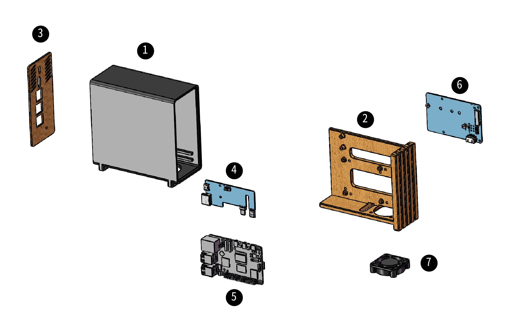

# Swap Pi | Raspberry Pi 5 case
Swap Pi icecifically designed for Raspberry Pi 5 and is not compatible with other models. Support rear USB PD Type-C, full HDMI, NVMe SSD mount and PWM 4010 FAN.
## Summary

The design style of this case is inspired by  [Fractal Design's North Pi](https://www.fractal-design.com/north-pi-3d-files/), but the structure is completely different.

The case features a pull-out design overall, making it easy for quick disassembly and assembly.

## Production process video

## Electronic
### Rear IO

Use the  [DeskPi KL-P24 Micro HDMI to HDMI expansion board](https://deskpi.com/collections/new-arrival/products/deskpi-kl-p24-raspberry-pi-adapter-board)to route the USB and micro HDMI ports of the Pi 5 to the back.

### NVMe expansion
On the other side, you can install an NVMe expansion board.

This red NVMe expansion board NVPI5-2280B from PCBWay comes with cables that can be used directly. It seems to be the only 2280 expansion board with just enough cable lengths

It also supports some other NVMe expansion boards, but some longer cables separately or you need modify fan power supply.

NVMe boards list

|   | Advise | Boards | 
| ------------- | ------------- |   ------------- |
| Tested |  Works | [boardname](https)  |
| Tested |  Works perfect | [NVPI5-2280B Pi5 NVMe Base board](https://www.pcbway.com/project/gifts_detail/NVPI5_2280B_d0fc0b49.html)  |
| Tested |  Works perfect  | [GeeekPi N10 Tiny PCIe M.2 Key-M NVMe SSD PCIe Peripheral Board](https://amzn.to/3WpMN7a)  |
| Tested |  FAN power need modify or bottom install with longer cable | [GeeekPi N05 M.2 NVMe to PCIe Adapter board](https://amzn.to/4d0VutS)  |
| Tested |  Only bottom install with longer cable, board needs modify | [GeeekPi N04 M.2 NVMe to PCIe Adapter](https://www.pcbway.com/project/gifts_detail/NVPI5_2280B_d0fc0b49.html)  |
| Tested |  Longer cable needed | [GeeekPi N07 PCIe M.2 M-key NVMe SSD PCIe Peripheral Bottom Board](https:)  |
| Untest |  Looks bottom install only with longer cable | [Geekworm X1001 PCIe to M.2 HAT KEY-M NVMe SSD PIP PCIe Peripheral Board](https://amzn.to/4f1ljw1)  |
| Untest |  Looks bottom install only with longer cable | [Geekworm X1002 PCIe to M.2 HAT NVMe SSD PIP PCIe Peripheral Bottom Board](https://amzn.to/468HJY6)  |
| Untest |  Looks can't work, too high | [Geekworm X1004 PCIe to Dual M.2 HAT NVMe 2280 SSD PCIe Peripheral Board](https://amzn.to/3zO76SZ)  |
| Untest |  Looks need longer cable | [NVMe Base for Raspberry Pi 5 M.2 HAT PCIe Extension Board](https://amzn.to/3zLFQEJ)  |
| Untest |  Looks bottom install only with longer cable | [Pineboards HatDrive! Top (NVMe 2230, 2242 GEN 3) for Raspberry Pi 5](https://amzn.to/4cWNzho)  |
| Untest |  Looks bottom install only with longer cable | [Pineboards HatDrive! Bottom (NVMe 2230, 2242, 2280 GEN 3) for Raspberry Pi 5](https://amzn.to/3zYa2fy)  |
| Tested |  Bottom install only with longer cable | [Official Pi PCIe to M.2 HAT for Raspberry Pi 5](https://amzn.to/3zVo0yQ)  |

>  Many of the device links on this page are `Amazon affiliate links`. If you do not wish to use those links, copy the device name to search for it at any major electronics retailer.**

### PWM WS2812 RGB 4010 FAN
I placed a interesting [4010 PI PWM RGB FAN](https://amzn.to/46bspKf) at the bottom of the case.

This 4-wire fan is different from all other 4-wire fans, its four signals are `5V power`, `ground`, `pwm`, `data`, there is no speed measurement, but a data line to control the ws2812 inside the fan. 

It can be controlled directly using a raspberry pi gpio to synchronize the fan speed and the color of the RGB through the cpu temperature.

 It's so cool.

This fan needs software code to work, you can visit my githhub to download it!

Rex.Tang github link: [https://github.com/tltangliang/PI5-Hardware-PWM](https://github.com/tltangliang/PI5-Hardware-PWM)

### Heat Set Insert
All screws are fixed with heat-set nuts, please use [M2.5*5*4](https://amzn.to/3W5I9db).

## Assemble

Swap Pi has 7 parts:

1. Swap Pi Case main part ( [3D print](https://github.com/tltangliang/Swap-Pi-Raspberry-Pi-5-case/releases/download/v1.0/Swap.Pi.Case.stl.v1.0.zip) )
2. Swap Pi Case front part ( [3D print](https://github.com/tltangliang/Swap-Pi-Raspberry-Pi-5-case/releases/download/v1.0/Swap.Pi.Case.stl.v1.0.zip) )
3. Swap Pi Case back part ( [3D print](https://github.com/tltangliang/Swap-Pi-Raspberry-Pi-5-case/releases/download/v1.0/Swap.Pi.Case.stl.v1.0.zip) )
4. DeskPi KL-P24 Micro HDMI to HDMI Adapter Board ( from [DeskPi.com](https://www.deskpi.com) )
5. Raspberry Pi 5 ( from [Raspberry Pi](https://www.raspberrypi.com/) )
6. NVMe base board NVPI5-2280B (from [PCBWay](https://www.pcbway.com/project/gifts_detail/NVPI5_2280B_d0fc0b49.html))
7. 4010 FAN (from [amazon.com](https://amzn.to/46bspKf) )

### Assembled Accessories
1. M2.5 screw x 11
2. [M2.5*5*4](https://amzn.to/3W5I9db) heat-set nuts x 11

